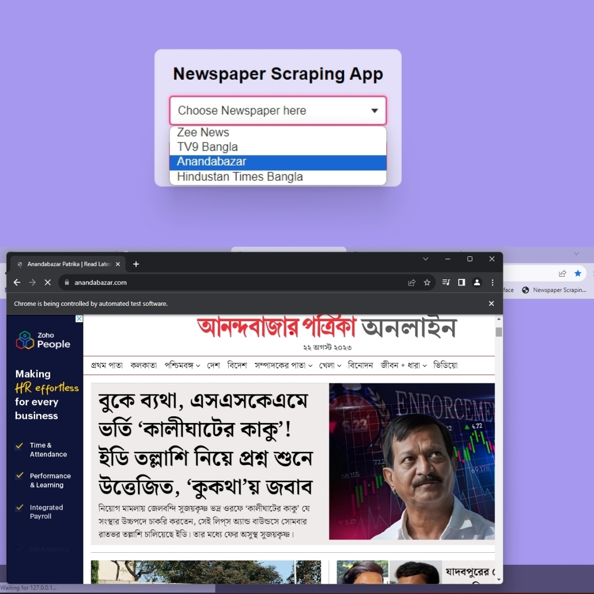

# News-Scraping-using-BeautifulSoup-Selenium-with-Django

[![Apache 2.0 License][license-shield]][license-url]
[![LinkedIn][linkedin-shield]][linkedin-url]

## Table of Contents
1. [About The Project](#about-the-project)
2. [Features](#features)
3. [Getting Started](#getting-started)
    - [Prerequisites](#prerequisites)
    - [Installation](#installation)
    - [Getting Started with Selenium](#getting-started-with-selenium)
        - [What is Web Scraping?](#what-is-web-scraping)
        - [What is Selenium?](#what-is-selenium)
        - [Installing Selenium](#installing-selenium)
        - [Installing Webdrivers](#installing-webdrivers)
4. [Usage](#usage)
5. [Changelog](#changelog)
6. [License](#license)
7. [Acknowledgements](#acknowledgements)

## About The Project

This project automates the process of scraping news articles from various sources using BeautifulSoup and Selenium, integrated into a Django application. It supports multiple websites and can run scraping tasks concurrently using threading. The data is stored in an Excel file and optionally in a MySQL database.

## Features

- Scrapes news articles from Hindustan Times, Hindustan Times Bangla, Zee News, TV9 Bangla, and Ananda Bazar.
- Concurrent scraping using threading with a delay between iterations.
- Supports both on-demand scraping and scheduled scraping tasks.
- Saves scraped data to Excel files and a MySQL database.
- Creates a new folder for data storage based on the current date.

## Images of the Scraping


## Getting Started

To get a local copy up and running, follow these steps.

### Prerequisites

- Python 3.6+
- Django 3.0+
- Selenium
- BeautifulSoup
- MySQL (for database storage)

### Installation

1. Clone the repository:
    ```sh
    git clone https://github.com/iam-baivab/News-Scraping-using-BeautifulSoup-Selenium-with-Django.git
    ```
2. Navigate to the project directory:
    ```sh
    cd News-Scraping-using-BeautifulSoup-Selenium-with-Django
    ```
3. Install required Python packages:
    ```sh
    pip install -r requirements.txt
    ```
4. Set up the Django project:
    ```sh
    python manage.py migrate
    python manage.py createsuperuser
    ```
5. Update the database configuration in `settings.py` if using MySQL.

### Getting Started with Selenium

#### What is Web Scraping?

Web scraping is a technique for extracting information from the internet automatically using software that simulates human web surfing.

#### What is Selenium?

Selenium is a **free (open-source) automated testing framework** used to validate web applications across different browsers and platforms. It can be used for **automating web browsers to do a number of tasks** such as web-scraping.

#### Installing Selenium

To install Selenium:
```sh
pip install selenium # (Python 2)
pip3 install selenium # (Python 3)
```

#### Installing Webdrivers

Selenium requires a **driver** to interface with the chosen browser. Firefox, for example, requires geckodriver, which needs to be installed before the below examples can be run. Note that the webdriver must be located in your `PATH`, e.g., place it in `/usr/bin` or `/usr/local/bin`.

Other supported browsers will have their own drivers available. Links to some of the more popular browser drivers are as follows:

- **Chrome**: [https://sites.google.com/a/chromium.org/chromedriver/downloads](https://sites.google.com/a/chromium.org/chromedriver/downloads)
- **Edge**: [https://developer.microsoft.com/en-us/microsoft-edge/tools/webdriver/](https://developer.microsoft.com/en-us/microsoft-edge/tools/webdriver/)
- **Firefox**: [https://github.com/mozilla/geckodriver/releases](https://github.com/mozilla/geckodriver/releases)
- **Safari**: [https://webkit.org/blog/6900/webdriver-support-in-safari-10/](https://webkit.org/blog/6900/webdriver-support-in-safari-10/)

For this project, I am using Chrome's webdriver called **Chromedriver**. There are multiple ways to install Chromedriver:
1. Using [**webdriver-manager**](https://pypi.org/project/webdriver-manager/) (recommended)
    
    - Install package:
        ```sh
        pip install webdriver-manager # (Python 2)
        pip3 install webdriver-manager # (Python 3)
        ```     
    - Load package:
        ```python
        from selenium import webdriver
        from webdriver_manager.chrome import ChromeDriverManager

        driver = webdriver.Chrome(ChromeDriverManager().install())
        ```

2. **Manual download** from [**Chrome's website**](https://sites.google.com/a/chromium.org/chromedriver/downloads)

    - Load package:
        ```python
        from selenium import webdriver

        driver = webdriver.Chrome(executable_path='/path/to/chromedriver')
        ```

## Usage

Run the Django development server:
```sh
python manage.py runserver
```

Navigate to the admin panel, configure the scraping tasks, and start the scraping process. The scraped data will be saved in the specified formats and locations.

## Changelog

### v1.0.1

- Initial release with scraping from Hindustan Times.

### v1.0.1.1

- Added scraping from Hindustan Times Bangla.

### v1.0.1.2

- Added scraping from Zee News.

### v1.0.1.3

- Added scraping from TV9 Bangla.

### v1.0.1.4

- Added scraping from Ananda Bazar.

### v2.0.1

- Dynamic scraping based on request value.

### v2.0.1.1

- Appending data to existing `scraped_data.xlsx`.

### v3.0.1

- Concurrent scraping with threading.

### v3.0.1.1

- Automatic folder creation based on current date.

### v4.0.1

- Integration with MySQL database and updated Django models.

## License

Distributed under the Apache License 2.0. See `LICENSE` for more information.

## Acknowledgements

- [BeautifulSoup](https://www.crummy.com/software/BeautifulSoup/)
- [Selenium](https://www.selenium.dev/)
- [Django](https://www.djangoproject.com/)

[license-shield]: https://img.shields.io/badge/License-Apache%202.0-red.svg
[license-url]: https://github.com/iam-baivab/News-Scraping-using-BeautyfulSoup-Selenium-with-Django/blob/main/LICENSE
[linkedin-shield]: https://img.shields.io/badge/-LinkedIn-black.svg?style=flat&logo=linkedin&colorB=blue
[linkedin-url]: https://www.linkedin.com/in/baivabsarkar/
